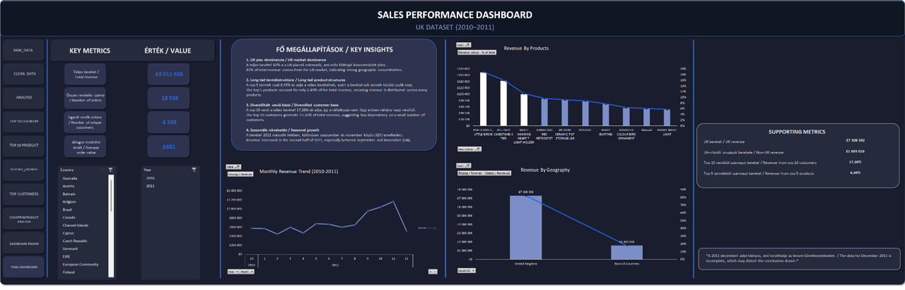

## Hi there, I am Barnabás 👋

🇭🇺 Magyar verzió  
Scroll down for English 🇬🇧

---

## 👤 Rólam

Közgazdász végzettségű, adatorientált szakember vagyok, több, mint 5 év gyakorlati tapasztalattal e-kereskedelmi környezetben.

Munkám során napi szinten dolgoztam rendelési, ügyfél-és termékadatokkal, így hatékonyan átlátom az üzleti folyamatokat.

Jelenleg Excel-alapú projekteken keresztül tudatosan fejlesztem magam junior adatelemzői/reporting irányba.

---

## 🛠️ Fókuszterületeim

- Excel adattisztítás
- Pivot táblák és kimutatások készítése
- KPI-számítások
- Dashboard építés
- Értékesítési-és ügyfélelemzés
- Üzleti jelentések készítése

---

## 📁 Portfólióprojektek

### 📊 Sales Performance Analysis – Excel Dashboard  

Egy teljes körű értékesítési adatelemzési projekt Excelben, amely magában foglalja az adattisztítást, KPI-számításokat, pivot elemzéseket és egy üzleti döntéstámogatásra alkalmas dashboard kialakítását.

**Főbb eredmények:**
- Interaktív dashboard készítése üzleti betekintésekhez  
- Legjobban teljesítő termékek és bevételi források azonosítása  
- Ügyfél-és ország szintű teljesítmény elemzése

🔗 GitHub: https://github.com/haderbarnabas/UK-Dataset-Analysis-Excel

---

## 📫 Kapcsolat

- LinkedIn: https://www.linkedin.com/in/barnabás-hadersprung-7794573a3  
- GitHub: https://github.com/haderbarnabas  
- Email: sprungy87@gmail.com  

---

# English version

## 👤 About me

I am an Economics graduate with over 5 years of hands-on experience in an e-commerce environment, working with order, customer, and product data on a daily basis.

This experience has helped me develop a strong analytical mindset and a solid understanding of business processes.

I am currently transitioning into a junior data analyst/reporting role and actively building my skills through Excel-based data analysis projects.

---

## 🛠️ Focus areas

- Excel data cleaning
- Pivot tables
- KPI calculations
- Dashboard building
- Sales and customer analysis
- Business reporting

---

## 📁 Portfolio projects

### 📊 Sales Performance Analysis – Excel Dashboard  

An end-to-end sales data analysis project built in Excel, including data cleaning, KPI calculations, pivot table analysis, and dashboard creation.

**Key highlights:**
- Built an interactive dashboard for business insights  
- Identified top-performing products and revenue drivers  
- Analyzed customer and country-level performance  

🔗 GitHub: https://github.com/haderbarnabas/UK-Dataset-Analysis-Excel/edit/main/README.md

---

## 📫 Contact

- LinkedIn: https://www.linkedin.com/in/barnabás-hadersprung-7794573a3  
- GitHub: https://github.com/haderbarnabas  
- Email: sprungy87@gmail.com  
